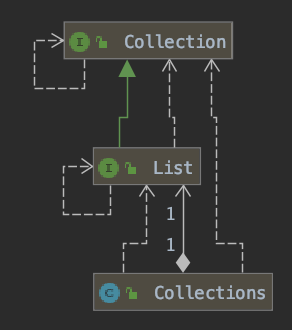

[1. 자바8](#자바8) <br>
[2. 자바 함수](#자바-함수) <br>
[3. 스트림](#스트림) <br>
[4. 디폴트 메서드](#디폴트-메서드) <br>
[5. 그 외](#함수형-프로그래밍에서-가져온-다른-유용한-아이디어) 

<br>


## Chapter 01

### 자바8

고전적인 객체지향에서 벗어나 함수형 프로그래밍에 가까워짐

- 스트림 API
- 메서드에 코드를 전달하는 기법 (메서드 참조, 람다)
- 인터페이스의 디폴트 메서드

스트림 API 덕분에 아래 두 가지도 가능해졌다. 

동작 파라미터화 익명 클래스 


1. 스트림 처리 

스트림 : 한번에 한개씩 만들어지는 연속적인 데이터 항목들의 모임

```
java.util.stream 
Stream<T> T형식으로 구성된 일련의 항목을 의미 
```

=> 스레드를 사용하지 않으면서 병렬성을 가진다. 


2. 동작 파라미터화로 메서드에 코드 전달하기

메서드를 다른 메서드의 인수로 넘겨주는 기능 ex) sort
함수형 프로그래밍 (함수를 일급값으로 사용한다, 프로그램이 실행되는 동안 컴포넌트 간에 상호작용이 일어나지 않는다.)

3. 병렬성과 공유 가변 데이터

'병렬성을 공짜로 얻을 수 있다.'

병렬로 **안전하게 실행**하는 코드를 만들기 위해서는 **공유된 가변 데이터에 접근하지 않아야** 한다. => 순수 함수, 부작용 없는 함수, 상태 없는 함수

<br>

---

### 자바 함수

일급 시민 : 객체, 기본값과 같이 값을 바꿀 수 있는.. 
이급 시민 : 메서드, 클래스와 같이 자유롭게 전달할 수 없는 구조체

'이급 시민을 일급 시민으로 바꿔보자 (java8)'


=> 메서드 참조 (Method reference :: )

```java
File[] hiddenFiles = new File(".")
													.listFiles(File::isHidden);
```

=> 람다 (lambda)

함수형 프로그래밍 : 람다 문법 형식으로 구현된 프로그램, 함수를 일급값으로 넘겨주는 프로그램을 구현

✓ 람다가 몇 줄 이상으로 길어진다면, 익명 람다보다는 코드가 수행하는 일을 잘 설명하는 이름을 가진 메서드를 정의하고 메서드 참조를 활용하자 (**코드의 명확성**)

<br>

---

### 스트림

*"컬렉션을 처리하면서 발생하는 모호함과 반복적인 코드 문제"*

- for-each 루프를 이용한 **외부 반복**
- 스트림 API를 이용한 **내부 반복** (간소한 코드, 내부적으로 데이터 조작)

*"멀티코어 활용 어려움"*
컬렉션을 사용하여 많은 요소를 가진 목록을 반복한다면 오랜 시간이 걸릴 수 있다. => 멀티 CPU를 이용하여 병렬로 작업할 수 있다면 빠르게 작업을 처리할 수 있지 않을까 ? 

예전 java > 멀티스레딩  
각각의 스레드가 동시에 공유된 데이터에 접근하고 갱신, 관리가 어렵다. 

java8 > 스트림 API - 필터링, 추출, 그룹화 

<br>

---

### 디폴트 메서드

인터페이스를 업데이트하려면 해당 인터페이스를 구현하는 모든 클래스도 업데이트를 해야했다. => 디폴트 메서드로 해결


 
java8 이전에는 List\<T>, Collecition\<T>에서 stream()이나 parallelStream() 메서드를 지원하지 않았다. Collection 인터페이스에 stream 메서드를 추가한다면, ArrayList와 같이 Collection 인터페이스를 구현하는 수많은 클래스에서 해당 메서드를 구현해야 했다. 

어떻게 기존 구현을 고치지 않고 공개된 인터페이스를 변경할 수 있을까 ?

=> 구현하지 않아도 되는 메서드를 인터페이스에 추가할 수 있는 기능을 추가

```java
@SuppressWarnings({"unchecked", "rawtypes"})
default void sort(Comparator<? super E> c) {
  Object[] a = this.toArray();
  Arrays.sort(a, (Comparator) c);
  ListIterator<E> i = this.listIterator();
  for (Object e : a) {
    i.next();
    i.set((E) e);
  }
}
```

List 인터페이스 中 ..

<br>

---

### 함수형 프로그래밍에서 가져온 다른 유용한 아이디어

- Optional\<T>
- 구조적 패턴 매칭
