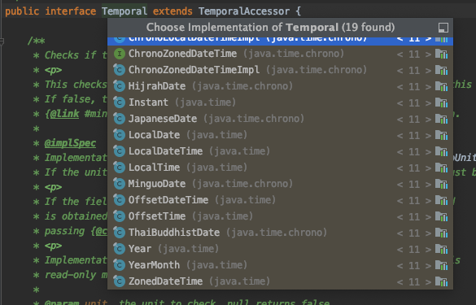

# 새로운 날짜와 시간 API 

<br>

_java.util.Date (java 1.0)_

1900년을 기준으로 하는 offset, 0에서 시작하는 월 index, 날짜가 아닌 밀리초 단위의 표현

<br>

_java.util.Calendar (java 1.1)_

0에서 시작하는 월 index, dateFormat 메서드 미지원, Date 클래스와의 혼동

<br>

_java.time (java 8)_

Date와 Calendar의 대안으로 추가 <br>
LocalDate, LocalDateTime과 같은 불변 클래스 추가

[Date, Calendar 객체의 문제점](https://madplay.github.io/post/reasons-why-javas-date-and-calendar-was-bad)


<br>

## java.time 패키지

**날짜와 시간 관련 API 제공** <br>
LocalDate, LocalTime, LocalDateTime, Instant, Duration, Period 등의 클래스 포함

[코드로 확인하기](LocalDateTimeMain.java)


**Temporal** 

=> 특정 시간을 모델링하는 객체의 값을 어떻게 읽고 조작할지 정의한 인터페이스 <br>
=> 수많은 시간 객체들이 구현하고 있다. 



**LocalDate, LocalTime**

- of : 날짜/시간 값을 이용해 인스턴스 생성
- parse : 문자열을 이용해 인스턴스 생성
- get(TemporalField field) : field에 해당하는 날짜/시간값을 반환


**LocalDateTime** 

=> LocalDate와 LocalTime을 갖는 복합 클래스 <br>=> 여러 정적 메서드 패턴을 이용해 인스턴스를 생성할 수 있다. 

- of(int year, int month, int dayOfMonth, int hour, int minute, int second, int nanoOfSecond)
- of(LocalDate date, LocalTime time)
- LocalDate.atTime(int hour, int minute, int second)
- LocalTime.atDate(int year, int month, int dayOfMonth)


**Instrant**

=> Unix epoch time(1970년 1월 1일 0시 0분 0초 UTC)를 기준으로 특정 지점까지의 시간을 초로 표현 <br>=> nanoSecond의 정밀도

<br>

#### 시간 비교

[코드로 확인하기](DateTimeDiff.java)


**Duration**

=> 두 시간 객체 사이의 지속시간 duration을 생성


**Period**

=> 두 LocalDate의 차이를 생성


<br>

### 불변 시간 객체 값 변경해보기

기본적으로 앞서 설명한 클래스들은 불변 클래스로 생성되어 있다. 하지만 Temporal 인터페이스의 get 혹은 with 메서드를 이용해 객체의 필드값을 조회/수정할 수 있다. 필드값 수정은 실제 값 변경이 아니라 필드를 갱신한 복사본을 만든다.

```java
private LocalDateTime with(LocalDate newDate, LocalTime newTime) {
  if (date == newDate && time == newTime) {
    return this;
  }
  return new LocalDateTime(newDate, newTime);
}
```

존재하지 않는 필드를 조회/수정할 경우, UnsupportedTemporalTypeException 발생시킨다. 

[코드로 확인하기](DateTimeChange.java)


TemporalAdjusters를 이용하면 더 복잡한 날짜 조정이 가능하다. 

```java
@FunctionalInterface
public interface TemporalAdjuster {
  Temporal adjustInto(Temporal temporal);
}
```


커스텀 TemporalAdjuster를 만들수도 있다. 

[Custom TemporalAdjuster 구현해보기](NextWorkingDay.java)

[Custom TemporalAdjuster 사용해보기](CustomTemporalAdjusterMain.java)
