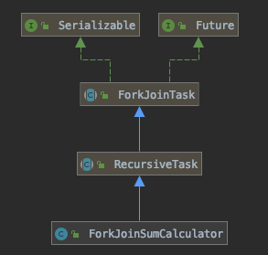

1. 병렬 스트림 <br>
	[1. 스레드 관리](#스레드-관리) <br>	[2. 성능 측정](#성능-측정) <br>	[3. 병렬 스트림 효과적으로 사용하기](#병렬-스트림-효과적으로-사용하기) <br>

2. 포크/조인 프레임워크 <br>
   	[1. RecursiveTask 활용](#RecursiveTask-활용) <br>	[2. 포크/조인 프레임워크 제대로 사용하기](#포크-조인-프레임워크-제대로-사용하기) <br>	[3. 작업 훔치기](#작업-훔치기) <br>
3. [Spliterator](#Spliterator)

 <br>

# 병렬 데이터 처리와 성능

포크/조인 프레임워크가 추가되기 전, 자바 7 전까지는 데이터 컬렉션을 병렬로 처리하기 어려웠다. 
데이터 분할부터 스레드 할당, 경쟁 상태를 고려한 동기화와 합병까지.. 고려해야 할 부분이 많았는데,...

자바 7에서 포크/조인 프레임워크 기능이 제공되고 이후 스트림의 내부 병렬 스트림까지 제공되면서 컬렉션 데이터에 대해 얼마나 쉽게 병렬 처리가 가능해졌는지 확인할 수 있다. 

<br>

---

## 병렬 스트림

모든 멀티코어 프로세서가 각각의 스레드에서 처리할 수 있도록 스트림 요소를 여러 청크로 분할한 스트림


#### 병렬 스트림 생성

- **Collection의 parallelStream** : 컬렉션에서 병렬 스트림 생성시, 사용

- **Stream의 parallel** : 순차 스트림을 병렬 스트림으로 바꿔줌 (실제로는 병렬 스트림 여부 플래그를 변환)

```java
// AbstractPipeline 
@Override
@SuppressWarnings("unchecked")
public final S parallel() {
   sourceStage.parallel = true;
   return (S) this;
}
```

- **Stream의 sequential** : 병렬 스트림을 순차 스트림으로 바꿔줌 

```java
 @Override
 @SuppressWarnings("unchecked")
 public final S sequential() {
    sourceStage.parallel = false;
    return (S) this;
 }
```

parallel과 sequential 두 메서드를 같이 사용할 경우, 최종적으로 호출된 메서드가 전체 파이프라인에 영향을 미친다. 

<br>

### 스레드 관리

내부적으로 ForkJoinPool을 사용한다. <br>
ForkJoinPool은 기본적으로 프로세서 수가 반환하는 값에 상응하는 스레드를 갖는다.

(Runtime.getRuntime().availableProcessors()로 확인할 수 있음)


<br>

### 성능 측정

JMH를 이용한 성능 측정

코드로 확인하기 


<br>


@BenchmarkMode(Mode.AverageTime) <br>
=> 벤치마크 대상 메서드를 실행하는데 걸린 평균 시간 측정

@OutputTimeUnit(TimeUnit.MILLISECONS) <br>
=> 벤치마크 결과 밀리초 단위로 표시

@Fork(2, jvmArgs={"-Xms4G", "-Xmx4G"}) <br>
=> 4GB인 힙 공간을 제공한 환경에서 두 번 벤치마크를 수행해 결과 신뢰성 확보

```
$gradle jmh
```


<br>


**성능 측정 관련 참고 글**

- https://hyesun03.github.io/2019/08/27/how-to-benchmark-java/
- https://javabom.tistory.com/75


<br>


***적절한 자료구조를 선택할 것***

=> 특화되지 않은 스트림을 처리할 때는 오토박싱, 언박싱과 같은 작업으로 인해 오버헤드가 발생할 수 있다. 

=> 병렬 처리라도 반복 형식과 순차 처리보다 성능이 떨어질 수 있다.


***병렬화은 공짜가 아니다***

=> 병렬 이용 

 	1. 스트림을 재귀적으로 분할
 	2. 서브스트림을 서로 다른 스레드의 리듀싱 연산으로 할당
 	3. 결과를 합산

=> 코어간 데이터 전송은 비싸므로, 데이터 전송보다 오래 걸리는 작업을 병렬로 수행하자


***공유된 가변 상태는 병렬 계산에서 사용하지 않는다.***

코드로 확인하기


<br>


### 병렬 스트림 효과적으로 사용하기

1. 확신이 없다면 적절한 벤치마크를 이용해 직접 성능을 측정하자.

2. 박싱은 오버헤드가 클 수 있으니 되도록 기본형 특화 스트림(IntStream, LongStream, DoubleStream)을 사용하자.

3. 요소의 순서에 의존하는 연산(limit, findFirst)은 병렬 스트림에서 비싼 비용을 치러야 할 수도 있다. <br> findAny가 findFirtst보다 성능이 좋고, 정렬된 스트림보다 정렬되지 않은 스트림에서 limit의 성능이 더 좋다.

4. 스트림에서 수행하는 전체 파이프라인 연산 비용을 고려하라. <br> 처리해야 할 요소 수 * 하나의 요소를 처리하는데 드는 비용 => 하나의 요소를 처리하는데 드는 비용이 커질수록 병렬이 유리할 수 있다.

5. 소량의 데이터에서는 사용하지 말자.

6. 스트림의 분해에 적절한 자료구조가 있다. 참고해서 확인하라.

   | 소스            | 분해성 |
   | --------------- | ------ |
   | ArrayList       | 훌륭함 |
   | LinkedList      | 나쁨   |
   | IntStream.range | 훌륭함 |
   | Stream.iterate  | 나쁨   |
   | HashSet         | 좋음   |
   | TreeSet         | 좋음   |

7. 스트림의 길이를 측정할 수 없다면 효과적인 병렬 처리가 어려울 수 있다. <br> 따라서 중간연산이 스트림의 특성을 어떻게 바꾸는지 확인해라. <br> SIZED 스트림은 효과적, 필터 연산은 길이 측정이 어려우니 비효과적이다.

8. 최종 연산의 병합 과정이 비싸면 병렬이 효과적으로 상쇄해줄 수 있다. 

<br>

---

<br>

## 포크/조인 프레임워크

병렬화할 수 있는 작업을 재귀적으로 작은 작업으로 분할한 다음, 서브태스크 각각의 결과를 합쳐서 전체 결과를 만들도록 설계 (분할 정보 알고리즘의 병렬화 버전)

서브태스크를 스레드 풀의 작업자 스레드에 분산 할당하는 ExecutorSevice 인터페이스를 구현한다. 


<br>


### RecursiveTask 활용

스레드 풀을 이용하기 위해서는 ForkJoinTask을 상속하고 있는 RecursiveTask\<V>의 서브클래스를 만들어야 한다. RecursiveTask를 정의하면 추상메서드 compute를 구현해야 한다.

```
V:  병렬화된 태스크가 생성하는 결과 형식 or 결과가 없을 때는 RecursiveAction 형식
```

 <br>

**compute** 메서드는 다음과 같이 동작한다. 

```
if(태스크가 충분히 작거나 더 이상 분할할 수 없으면) {
	순차적으로 태스크 계산
} else {
	태스크를 두 서브태스크로 분할
	태스크가 다시 서브태스크로 분할되도록 이 메서드를 재귀적으로 호출
	모든 서브태스크의 연산이 완료될 때까지 기다림
	각 서브태스크의 결과 합침
}
```

<br>

[ForkJoinSumCalculator - 구현 코드 확인하기](ForkJoinSumCalculator.java) <br>
[ForkJoinSumCalculator - 실행 코드 확인하기](ForkJoinSum.java)



<br>


### 포크 조인 프레임워크 제대로 사용하기

1. 두 서브태스크가 모두 시작된 다음에 join을 호출하자. join 메서드를 태스크에 호출하면 태스크가 생산하는 결과가 나올때까지 호출자를 대기시키기 때문에 다른 태스크가 작업을 수행하지 못한다. 
2. RecursiveTask 내에서는 ForkJoinPool의 invoke 메서드는 사용하지 않을것. compute나 fork는 사용해도 된다. 순차 코드에서 병렬 계산을 시작할 때만 invoke를 사용하도록 한다.
3. 두 개의 서브태스크가 있다면 하나는 fork, 하나는 compute를 수행하는게 효율적이다. 한 태스크에 같은 스레드를 재사용할 수 있으므로 불필요한 태스크 할당을 피할 수 있다.
4. 디버깅이 어렵다는 점 기억하자. Fork 스레드에서 compute까지 호출하니 !
5. 포크/조인 프레임워크가 순차 처리보다 무조건 빠를거라는 생각은 버리자. 
   병렬 처리로 성능을 개선하기 위해서는 1) 독립적인 서브태스크로 분할이 가능해야 하고 2) 각 서브태스크의 실행시간이 새로운 태스크를 포킹하는데 드는 시간보다 길어야 한다. 

<br>

### 작업 훔치기
; Work Stealing

ForkJoinPool의 모든 스레드를 공정하게 분할하는 방법.

분할된 작업을 쌓아두는 큐가 있다. 스레드는 모든 큐가 빌 때까지 큐에 쌓인 태스크를 수행한다. <br>
본인의 큐, 혹은 다른 스레드 큐의 꼬리에 있는 작업을 훔쳐오는 과정으로 태스크를 재분배하고 균형을 맞추는 것.

<br>

---

<br>

## Spliterator

분할할 수 있는 반복자 (Splitable Interator) <br>
; Iterator와 같이 소스의 요소 탐색 기능을 제공하지만 병렬 작업에 특화되어 있다. 


```java
public interface Spliterator<T> {
  boolean tryAdvance(Consumer<? super T> action);
  Spliterator<T> trySplit();
  long estimateSize();
  int characteristics();
}
```

**T** : Spliterator에서 탐색하는 요소의 형식

 <br>

- **tryAdvance** <br>
  => Spliterator의 요소를 하나씩 순차적으로 소비하면서 탐색해야 할 요소가 남아있으면 참을 반환. <br>
- **trySplit**  <br>=> Spliterator의 일부 요소를 분할해서 두 번째 Spliterator 생성 반환. <br>
- **estimateSize** <br>
  => 탐색해야 할 요소의 수 반환. <br>
- **characteristics**  <br>=> Spliterator 자체의 특성 집합을 포함하는 int를 반환. <br>


### Spliterator의 특성

| 특정       | 의미                                                         |
| ---------- | ------------------------------------------------------------ |
| ORDERED    | 순서가 정해진 데이터 요소에서 Spliterator는 요소를 탐색/분할할 때 순서에 유의해야 한다. |
| DISTINCT   | x, y 두 요소를 방문할 때, x.equals(y)는 항상 false를 반환한다. |
| SORTED     | 탐색된 요소는 미리 정의된 정렬 순서를 따른다.                |
| SIZED      | 크기가 알려진 데이터로 생성된 경우, estimatedSize()는 정확한 값을 반환한다. |
| NON-NULL   | 탐색하는 모든 요소는 NULL이 아니다.                          |
| IMMUTABLE  | Spliterator의 모든 요소는 불변이다.                          |
| CONCURRENT | 동기화 없이 Spliterator의 소스를 여러 스레드에서 동시에 고칠 수 없다. |
| SUBSIZED   | 분할된 Spliterator는 SIZED 특성을 갖는다.                    |


병렬 스트림에서는 기본적으로 컬렉션 프레임워크에서 구현된 디폴트 Spliteraotor를 사용한다. 

```java
// Collection.java
@Override
default Spliterator<E> spliterator() {
  return Spliterators.spliterator(this, 0);
}
```

<br>

### Spliterator 구현해보기 

[Spliterator 직접 구현해보기(WordCounterSpliterator)](WordCounterSpliterator.java) <br>[단어 개수 찾기- 코드로 확인하기](WordCount.java) <br>


**늦은 바인딩 Spliterator** <br>
: 첫 번째 탐색 시점, 첫 번째 분할 시점, 또는 첫 번째 예상 크기 요청 시점에 요소의 소스를 바인딩한다.

