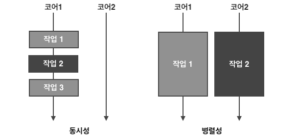

# CompletableFuture와 리액티브 프로그래밍 컨셉의 기초

## 동시성과 병렬성

**동시성** : 단일 코어 머신에서 발생할 수 있는 프로그래밍 속성으로 실행이 서로 겹칠 수 있다.

**병렬성** : 병렬 실행을 하드웨어 수준에서 지원

**병렬성 < 동시성이 더 필요한 상황**  
=> 스레드 블록이 아닌 코어를 바쁘게 만들어야 하는 상황

 

*병렬성 + 동시성 프로그래밍을 위해 자바는..*

*first* .. Runnable, Thread

*java5* .. ExecutorService interface => Callable\<T>, Future\<T>, 제네릭

*java7* .. java.util.concurrent.RecursiveTask (포크/조인 구현 지원)

*java8* .. 스트림 및 람다 지원에 기반한 병렬 프로세싱, CompletableFuture와 같은 Future 조합 기능

*java9* .. 분산형 비동기 프로그래밍, java.util.concurrent.Flow (발행-구독 프로토콜)

 

---

### Executor와 스레드 풀

*since java5*

**자바 스레드의 단점** 

=> 운영체제 스레드에 직접 접근   
=> 비싼 비용과 스레드 수의 한계

운영체제 스레드, 자바 스레드 > 하드웨어 스레드

**ExecutorService** 

=> task 제출, 나중에 결과 수집하는 인터페이스 제공  
=> 하드웨어에 맞는 수의 task를 유지하면서 동시에 수천개의 task를 스레드풀에 아무 오버헤드 없이 제출 

#### 스레드 풀

- 스레드를 직접 사용하는 것보다 스레드 풀을 이용하는 것이 더 낫다.

- k개의 스레드를 가진 스레드 풀은 오직 k 만큼의 스레드를 동시에 실행할 수 있다. 

- task가 k개를 초과하여 제출된다면 스레드를 할당하고 남은 나머지 task는 큐에 저장이 되어 먼저 할당된 task가 종료될때까지 기다린다. 

- 락이 걸릴 수 있는 task는 스레드 풀에 제출하지 않는게 좋다. 데드락에 걸릴 수 있기 때문이다. 

- 프로그램 종료 전, 스레드 풀을 종료시키는 습관이 중요하다. 

#### 스레드 - 중첩되지 않은 메서드 호출 
- 엄격한 포크/조인 : 스레드 생성과 join()이 한 쌍처럼 중첩된 메서드 호출내에 추가 되는 방식 (병렬 스트림 및 포크/조인 프레임워크)
- 비동기 메서드 : 메서드 호출자에 기능을 제공하도록 메서드가 반환된 후에도 만들어진 태스크 실행이 계속되는 메서드 

#### setDaemon() : 데몬(daemon) / 비데몬 구분
- 데몬 스레드 = 애플리케이션이 종료될 때 강제 종료 시킨다. 
    - 데이터 일관성 파괴 위험이 있다.
    - 따라서 데이터 일관성을 파괴하지 않는 동작을 수행할 때 유용하다.
    
- 비데몬 스레드 = 애플리케션을 종료하지 못하고 모든 스레드가 끝날때까지 기다린다. 
    - main() 메서드는 비데몬 스레드가 종료될 때까지 프로그램을 종료하지 않고 기다린다. 
    - 무한 대기 상태를 발생시킬 수 있다. 

